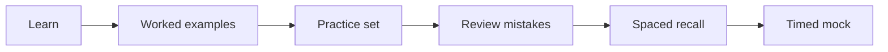

# AISSEE demo strategy

Use a repeatable learning loop:

## Weekly rhythm

1. Learn new concepts on most study days.
2. Revisit older topics using short recall blocks.
3. Use more than one quiz set for important chapters.
4. Review wrong answers before repeating a set.
5. Increase timed practice during the final phase.
