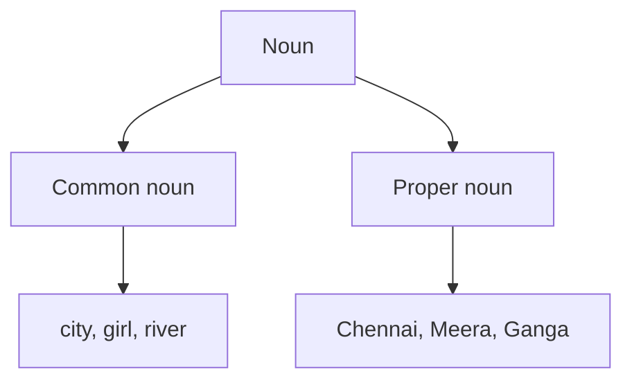

# Nouns

A **noun** is a word that names a person, place, animal, thing or idea.

Examples:

- person: **teacher**
- place: **school**
- animal: **tiger**
- thing: **book**
- idea: **kindness**

## Types in this lesson

A **common noun** is a general name. A **proper noun** is a specific name and normally begins with a capital letter in English.

## Quick example

> Riya visited the park.

`Riya` is a proper noun. `park` is a common noun.
