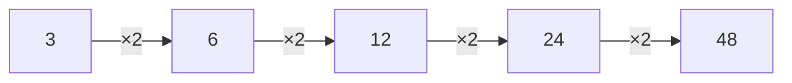

# Number Patterns

A number pattern follows a rule. Your task is to discover the rule and predict what comes next.

Example:

$$
2,\ 4,\ 6,\ 8,\ \boxed{10}
$$

The rule is:

$$
+2
$$

Another example:

$$
3,\ 6,\ 12,\ 24,\ \boxed{48}
$$

Here each number is multiplied by $2$.

## Tip

Check whether the sequence uses:

1. addition or subtraction,
2. multiplication or division,
3. alternating rules,
4. differences that themselves form a pattern.
