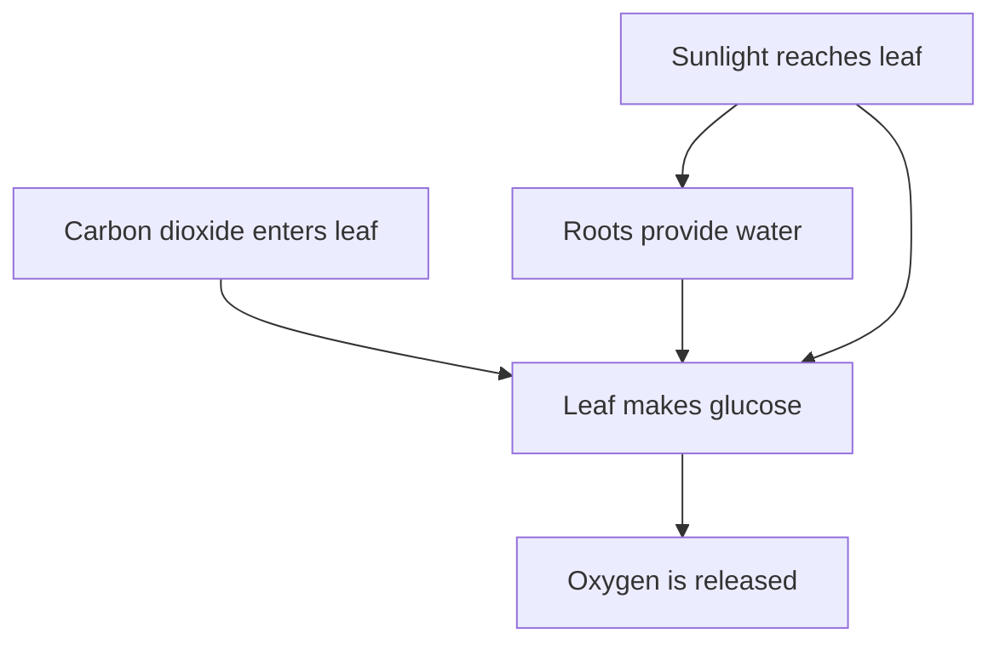

# Photosynthesis

Green plants make their own food using **sunlight, water and carbon dioxide**. This process is called **photosynthesis**.

A simplified word equation is:

$$
\text{Carbon dioxide} + \text{Water}
\xrightarrow{\text{Sunlight}}
\text{Glucose} + \text{Oxygen}
$$

A commonly written chemical form is:

$$
6CO_2 + 6H_2O \rightarrow C_6H_{12}O_6 + 6O_2
$$

## Process

Chlorophyll, the green pigment in leaves, helps absorb light energy.

## Remember

Plants use the glucose they make for energy and growth, while much of the oxygen is released into the air.
