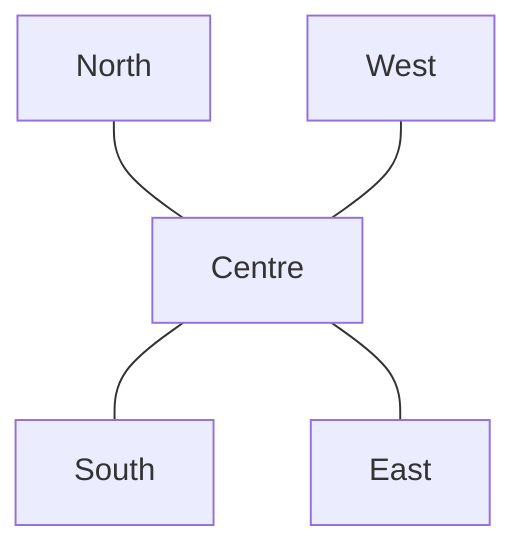

# Directions and Maps

Maps help us understand where places are located.

The four main directions are:

- North
- South
- East
- West

A **map symbol** represents something such as a road, hospital or railway station. A **legend/key** explains what the symbols mean.

## Scale

A map is smaller than the real world, so it uses a scale.

For example, if:

$$
1	ext{ cm on map} = 5	ext{ km on ground}
$$

then a distance of $3$ cm on the map represents:

$$
3 	imes 5 = 15	ext{ km}
$$
