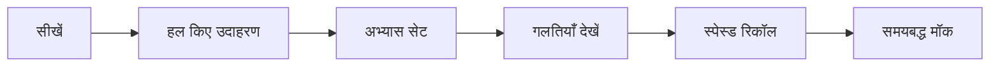

# JNVST डेमो रणनीति

एक दोहराने योग्य सीखने का चक्र अपनाएँ:

## साप्ताहिक क्रम

1. अधिकतर अध्ययन दिनों में नई अवधारणाएँ सीखें।
2. पुराने विषयों को छोटे रिकॉल ब्लॉक्स से दोहराएँ।
3. महत्वपूर्ण अध्यायों के लिए एक से अधिक क्विज़ सेट उपयोग करें।
4. सेट दोहराने से पहले गलत उत्तर समझें।
5. अंतिम चरण में समयबद्ध अभ्यास बढ़ाएँ।
