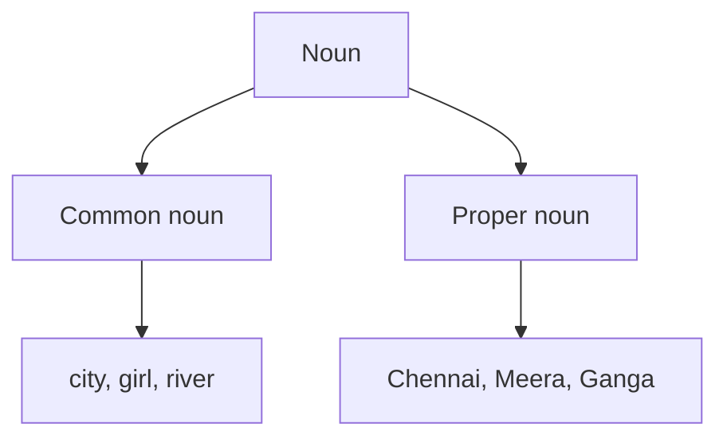

# संज्ञा

अंग्रेज़ी में **noun** वह शब्द है जो किसी व्यक्ति, स्थान, पशु, वस्तु या विचार का नाम बताता है।

उदाहरण:

- व्यक्ति: **teacher**
- स्थान: **school**
- पशु: **tiger**
- वस्तु: **book**
- विचार: **kindness**

## इस पाठ में

**Common noun** सामान्य नाम होता है। **Proper noun** किसी विशेष नाम को बताता है और अंग्रेज़ी में सामान्यतः बड़े अक्षर से शुरू होता है।

## छोटा उदाहरण

> Riya visited the park.

`Riya` proper noun है और `park` common noun है।
