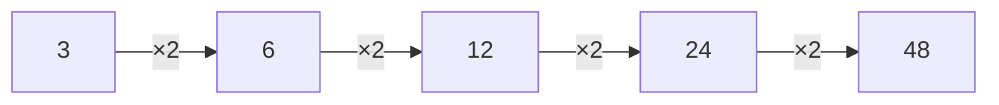

# संख्या पैटर्न

संख्या क्रम किसी नियम का पालन करता है। नियम पहचानकर अगली संख्या बतानी होती है।

उदाहरण:

$$
2,\ 4,\ 6,\ 8,\ \boxed{10}
$$

नियम है:

$$
+2
$$

दूसरा उदाहरण:

$$
3,\ 6,\ 12,\ 24,\ \boxed{48}
$$

यहाँ हर संख्या को $2$ से गुणा किया गया है।

## संकेत

जाँचें कि क्रम जोड़/घटाव, गुणा/भाग, बारी-बारी बदलने वाले नियम, या अंतर में किसी पैटर्न का उपयोग करता है।
