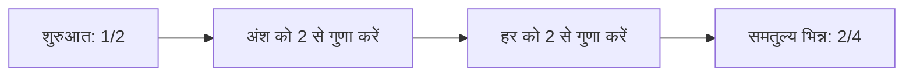

# समतुल्य भिन्न

कुछ भिन्न दिखने में अलग होते हैं, लेकिन वे **एक ही मान** दर्शा सकते हैं।

उदाहरण:

$$
\frac{1}{2} = \frac{2}{4} = \frac{3}{6}
$$

अंश और हर को **एक ही शून्येतर संख्या** से गुणा या भाग करने पर समतुल्य भिन्न मिलता है।

## उदाहरण

$\frac{2}{3}$ के अंश और हर दोनों को $2$ से गुणा करें:

$$
\frac{2 \times 2}{3 \times 2} = \frac{4}{6}
$$

इसलिए:

$$
\frac{2}{3} = \frac{4}{6}
$$

## इसे ऐसे समझें

## जल्दी जाँच

$\frac{a}{b}$ और $\frac{c}{d}$ समतुल्य हैं या नहीं, यह क्रॉस-गुणन से जाँचें:

$$
a \times d = b \times c
$$

$\frac{2}{3}$ और $\frac{4}{6}$ के लिए:

$$
2 \times 6 = 12,\qquad 3 \times 4 = 12
$$

दोनों क्रॉस-प्रोडक्ट समान हैं, इसलिए भिन्न समतुल्य हैं।
