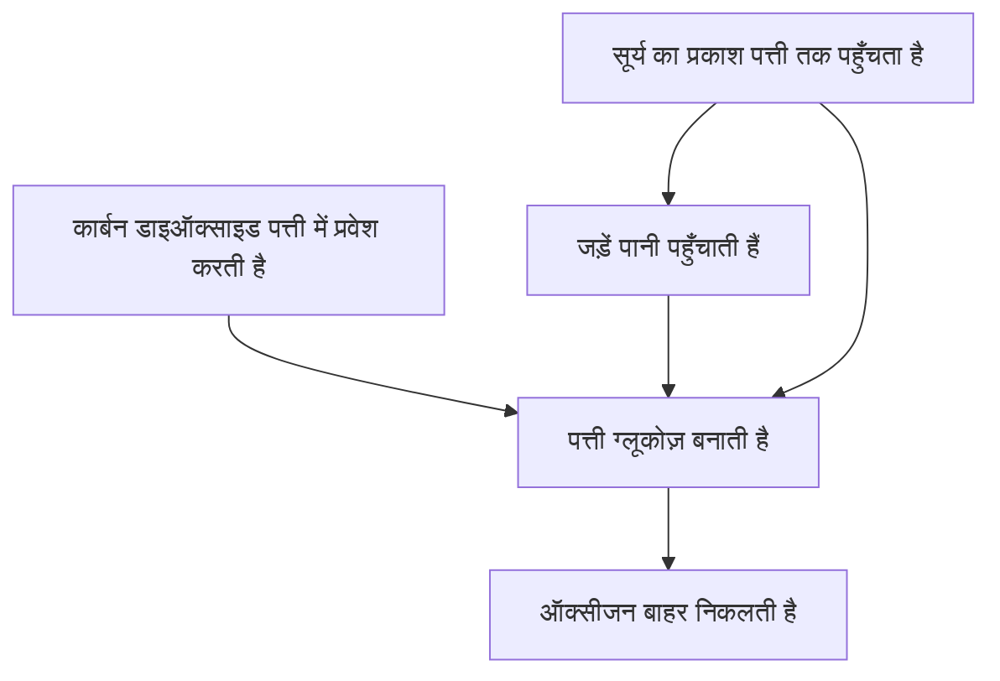

# प्रकाश संश्लेषण

हरे पौधे **सूर्य का प्रकाश, पानी और कार्बन डाइऑक्साइड** का उपयोग करके अपना भोजन बनाते हैं। इस प्रक्रिया को **प्रकाश संश्लेषण** कहते हैं।

सरल शब्द-समीकरण:

$$
\text{कार्बन डाइऑक्साइड} + \text{पानी}
\xrightarrow{\text{सूर्य का प्रकाश}}
\text{ग्लूकोज़} + \text{ऑक्सीजन}
$$

रासायनिक रूप में:

$$
6CO_2 + 6H_2O \rightarrow C_6H_{12}O_6 + 6O_2
$$

## प्रक्रिया

पत्तियों में मौजूद हरा वर्णक क्लोरोफिल प्रकाश ऊर्जा को अवशोषित करने में मदद करता है।

## याद रखें

पौधे बने हुए ग्लूकोज़ का उपयोग ऊर्जा और वृद्धि के लिए करते हैं और ऑक्सीजन का बड़ा भाग वायु में छोड़ते हैं।
