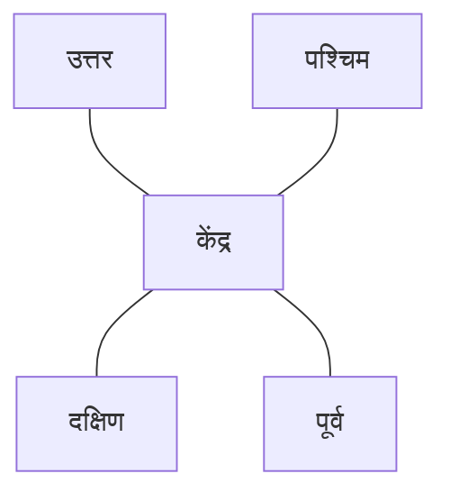

# दिशाएँ और मानचित्र

मानचित्र हमें यह समझने में मदद करते हैं कि स्थान कहाँ स्थित हैं।

चार मुख्य दिशाएँ हैं:

- उत्तर
- दक्षिण
- पूर्व
- पश्चिम

**मानचित्र प्रतीक** सड़क, अस्पताल या रेलवे स्टेशन जैसी चीज़ों को दर्शाता है। **Legend/Key** बताता है कि प्रतीकों का अर्थ क्या है।

## मापनी

मानचित्र वास्तविक दुनिया से छोटा होता है, इसलिए मापनी का उपयोग किया जाता है।

उदाहरण:

$$
1	ext{ सेमी मानचित्र पर} = 5	ext{ किमी वास्तविक दूरी}
$$

यदि मानचित्र पर दूरी $3$ सेमी है, तो वास्तविक दूरी:

$$
3 	imes 5 = 15	ext{ किमी}
$$
