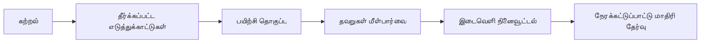

# JNVST மாதிரி உத்தி

மீண்டும் பயன்படுத்தக்கூடிய கற்றல் சுற்றை பின்பற்றுங்கள்:

## வார முறை

1. பெரும்பாலான நாட்களில் புதிய கருத்துகளை கற்றுக்கொள்ளுங்கள்.
2. பழைய தலைப்புகளை குறுகிய மீள்நினைவு பகுதிகளால் மீண்டும் பாருங்கள்.
3. முக்கிய தலைப்புகளுக்கு ஒன்றுக்கு மேற்பட்ட quiz set பயன்படுத்துங்கள்.
4. மீண்டும் முயல்வதற்கு முன் தவறான பதில்களைப் புரிந்துகொள்ளுங்கள்.
5. இறுதி கட்டத்தில் நேரக்கட்டுப்பாட்டு பயிற்சியை அதிகரிக்கவும்.
