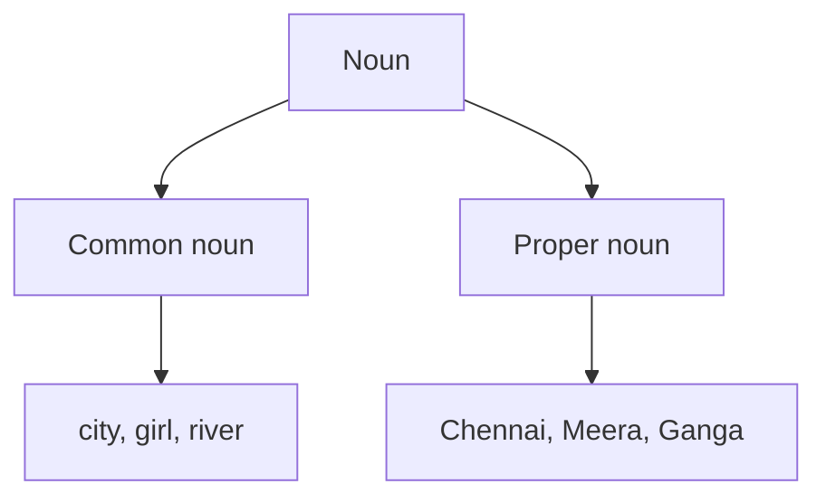

# பெயர்ச்சொற்கள்

ஆங்கிலத்தில் **noun** என்பது ஒரு நபர், இடம், விலங்கு, பொருள் அல்லது கருத்தின் பெயரைச் சொல்லும் சொல்.

உதாரணங்கள்:

- நபர்: **teacher**
- இடம்: **school**
- விலங்கு: **tiger**
- பொருள்: **book**
- கருத்து: **kindness**

## இந்தப் பாடத்தில்

**Common noun** என்பது பொதுப் பெயர். **Proper noun** என்பது குறிப்பிட்ட பெயர்; ஆங்கிலத்தில் இது பொதுவாக பெரிய எழுத்தால் தொடங்கும்.

## விரைவு உதாரணம்

> Riya visited the park.

`Riya` என்பது proper noun. `park` என்பது common noun.
