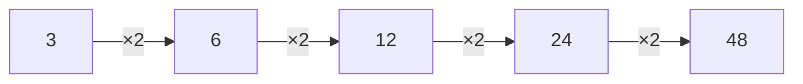

# எண் வடிவமைப்புகள்

ஒரு எண் தொடரில் ஒரு விதி இருக்கும். அந்த விதியை கண்டுபிடித்து அடுத்த எண்ணை கணிப்பதே நோக்கம்.

உதாரணம்:

$$
2,\ 4,\ 6,\ 8,\ \boxed{10}
$$

விதி:

$$
+2
$$

மற்றொரு உதாரணம்:

$$
3,\ 6,\ 12,\ 24,\ \boxed{48}
$$

இங்கு ஒவ்வொரு எண்ணும் $2$-ஆல் பெருக்கப்படுகிறது.

## குறிப்பு

தொடரைப் பார்க்கும்போது கூட்டல்/கழித்தல், பெருக்கல்/வகுத்தல், மாறி வரும் விதிகள், அல்லது வேறுபாடுகளிலுள்ள pattern ஆகியவற்றைச் சரிபார்க்கவும்.
