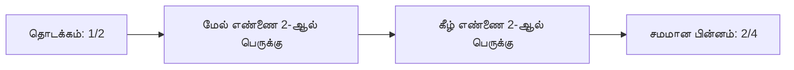

# சமமான பின்னங்கள்

பார்ப்பதற்கு வேறுபட்டிருந்தாலும் சில பின்னங்கள் **ஒரே மதிப்பை** குறிக்கலாம்.

உதாரணம்:

$$
\frac{1}{2} = \frac{2}{4} = \frac{3}{6}
$$

ஒரு பின்னத்தின் தொகுதியையும் (numerator), பகுதியையும் (denominator) **அதே பூஜ்யமல்லாத எண்ணால்** பெருக்கினாலோ வகுத்தாலோ சமமான பின்னம் கிடைக்கும்.

## உதாரணம்

$\frac{2}{3}$ இன் மேல் மற்றும் கீழ் எண்ணை $2$-ஆல் பெருக்குவோம்:

$$
\frac{2 \times 2}{3 \times 2} = \frac{4}{6}
$$

அதனால்:

$$
\frac{2}{3} = \frac{4}{6}
$$

## எளிய நடைமுறை

## விரைவு சரிபார்ப்பு

$\frac{a}{b}$ மற்றும் $\frac{c}{d}$ சமமா என்பதை குறுக்கு பெருக்கல் மூலம் பார்க்கலாம்:

$$
a \times d = b \times c
$$

$\frac{2}{3}$ மற்றும் $\frac{4}{6}$ க்கு:

$$
2 \times 6 = 12,\qquad 3 \times 4 = 12
$$

இரண்டு மதிப்புகளும் சமம்; எனவே பின்னங்களும் சமமானவை.
