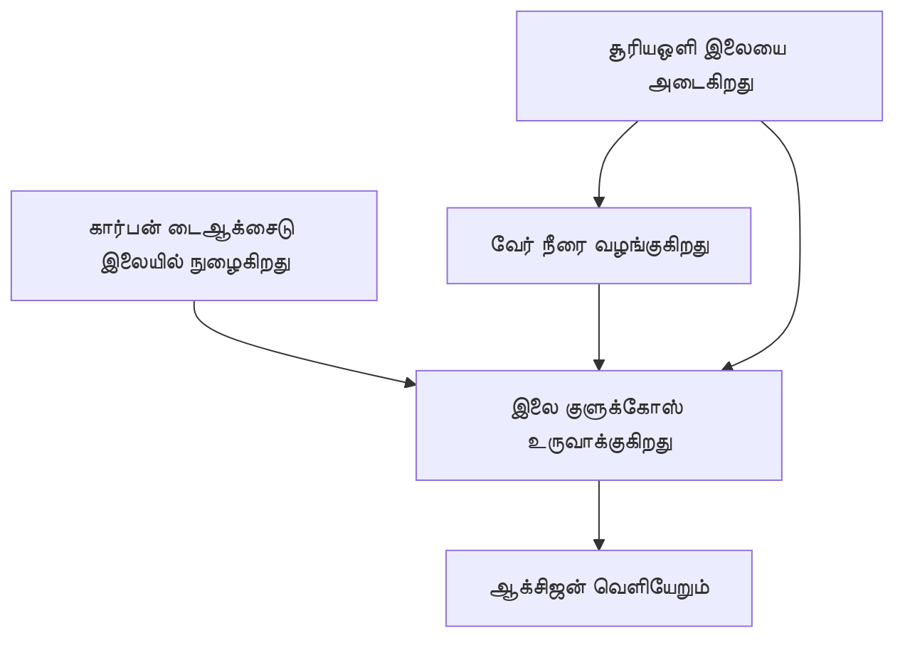

# ஒளிச்சேர்க்கை

பச்சைத் தாவரங்கள் **சூரியஒளி, நீர் மற்றும் கார்பன் டைஆக்சைடு** ஆகியவற்றைப் பயன்படுத்தி தங்களுக்குத் தேவையான உணவை உருவாக்குகின்றன. இந்தச் செயலே **ஒளிச்சேர்க்கை**.

எளிய சமன்பாடு:

$$
\text{கார்பன் டைஆக்சைடு} + \text{நீர்}
\xrightarrow{\text{சூரியஒளி}}
\text{குளுக்கோஸ்} + \text{ஆக்சிஜன்}
$$

வேதியியல் வடிவில்:

$$
6CO_2 + 6H_2O \rightarrow C_6H_{12}O_6 + 6O_2
$$

## செயல்முறை

இலைகளில் உள்ள பச்சை நிறமியான குளோரோபில் ஒளி ஆற்றலை உறிஞ்ச உதவுகிறது.

## நினைவில் கொள்ளுங்கள்

தாவரங்கள் உருவாக்கும் குளுக்கோஸை ஆற்றலுக்கும் வளர்ச்சிக்கும் பயன்படுத்துகின்றன; ஆக்சிஜன் பெரும்பாலும் காற்றில் வெளியிடப்படுகிறது.
