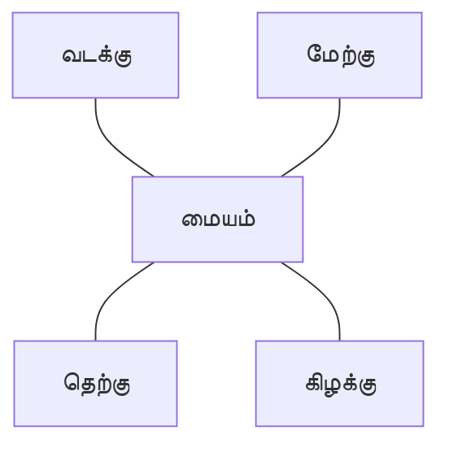

# திசைகளும் வரைபடங்களும்

ஒரு இடம் எங்கே உள்ளது என்பதைப் புரிந்துகொள்ள வரைபடங்கள் உதவுகின்றன.

நான்கு முக்கிய திசைகள்:

- வடக்கு
- தெற்கு
- கிழக்கு
- மேற்கு

**வரைபடக் குறியீடு** சாலை, மருத்துவமனை அல்லது ரயில் நிலையம் போன்றவற்றைக் குறிக்கும். **Legend/Key** அந்தக் குறியீடுகளின் பொருளை விளக்கும்.

## அளவுகோல்

வரைபடம் உண்மையான உலகை விட சிறியது; எனவே அளவுகோல் பயன்படுத்தப்படுகிறது.

உதாரணமாக:

$$
1	ext{ செ.மீ. வரைபடத்தில்} = 5	ext{ கி.மீ. தரையில்}
$$

வரைபடத்தில் $3$ செ.மீ. என்றால்:

$$
3 	imes 5 = 15	ext{ கி.மீ.}
$$
